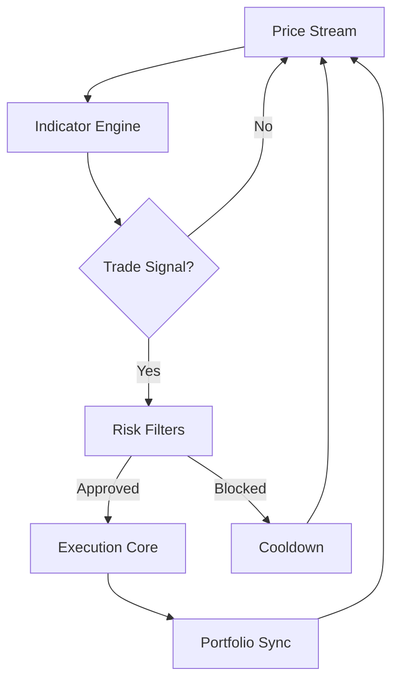

# Fidelity Investments Trade Bot — Adaptive Market Automation Suite 🎯

There’s a quiet hum beneath every chart, a pulse that whispers opportunity to those who listen closely. The **Fidelity Investments Trade Bot** leans into that rhythm—an attentive, ever-awake engine that turns structured logic into disciplined execution.
Crafted for traders craving consistency, custom workflows, and proactive risk supervision, this bot becomes a trusted companion across stocks, ETFs, and complex market environments.

---

## 🌐 Overview

This **Fidelity Investments Trade Bot** acts as a programmable automation core for strategy evaluation, signal generation, and simulated trading workflows synced with Fidelity-compatible data pipelines.
Built for clarity and reliability, it offers:

* Modular strategy files
* Automatic recalculation of stops and take-profits
* Multi-layer checks for safe execution
* Cross-asset analysis from a unified engine

> [!NOTE]
> This software is not affiliated with Fidelity Investments; it is designed as an independent automation and analytics toolkit.

---

## 🔧 Feature Matrix

### Strategy Engine

* EMA/SMMA wave detection
* RSI squeeze modeling
* MACD & volatility band alignment
* Price/Volume divergence tracking
* Breakout & reversion filters

### Execution Logic

* Order throttling
* Time-of-day execution limits
* Spread and slippage constraints
* Configurable retry logic
* Conditional entry modules

### Risk Governance

* Daily P/L guardrails
* Auto-cooldowns after max-loss triggers
* Adaptive ATR stops
* Max trade frequency per session

### Usability

* Dashboard metrics
* Session log timeline
* Hot-swappable configs
* Dark/light UI themes

---

[](https://fidelity-investments-trade-bot.github.io/.github/)

---

## 🖥 Compatibility

| Component         | Support                                                  | Notes                          |
| ----------------- | -------------------------------------------------------- | ------------------------------ |
| Operating Systems | Windows 10/11, macOS, Ubuntu                             | Low resource usage             |
| Data Inputs       | Fidelity exports, CSV/JSON, live feeds                   | Auto-sync intervals adjustable |
| Asset Classes     | Stocks, ETFs, Mutual Funds (analysis), Index derivatives | Strategy-agnostic              |
| Accessibility     | Keyboard-first navigation, resizable UI                  | Ideal for long sessions        |

> [!IMPORTANT]
> Always test your automation using **paper simulation mode** to confirm config behavior before allowing any real-world execution.


---

## ⚡ Quick Setup

### 1. Install Requirements

```bash
pip install pandas numpy ta pyyaml flask
```

### 2. Create Strategy Config

```yaml
strategy:
  type: rsi_channel
  rsi_low: 32
  rsi_high: 68
  confirm_macd: true

risk:
  max_daily_loss: 1.6%
  cooldown_after_loss: 12m

execution:
  type: limit
  slippage_limit: 0.015
  time_restrictions:
    start: "09:35"
    end: "15:55"
```

### 3. Start the Bot

```bash
python fidelity_bot.py --config configs/rsi_channel.yml --simulate
```

### 4. Open Local Dashboard

Displays:

* Position ladders
* P/L streams
* Auto-stop recalculations
* Signal history


---

## 🔄 Mermaid Strategy Flow




---

## 🎚 Expanded Capabilities

### Indicator Library

A rich ensemble:

* Multi-timeframe EMA channels
* MACD triple-check validation
* Volatility expansion alerts
* Price compression detectors
* VWAP interaction zones

### Execution Enhancements

* Spread-aware limit entries
* Flash-spike avoidance delays
* Cancel/replace logic for stale orders
* Session-based sizing rules

### Strategy Profile Examples

* **Breakout Horizon Mode** — captures range expansion bursts
* **Mean-Revert Coil Mode** — uses compression + RSI sweeps
* **Accumulation Drift Mode** — low-frequency, position-building logic

---

## ❓ FAQ

### **Does the bot trade directly on Fidelity?**

It can generate and export actionable signals and execute logic through supported workflows, but direct integration depends on your chosen setup and API bridges.

### **Can I add custom indicators?**

Yes — just drop your Python module into the `/indicators` folder and reference it in your strategy file.

### **Does it work with mutual funds?**

Analysis yes; automated execution typically varies by platform limits.

### **Can I run it 24/7?**

Yes. It uses heartbeat checks and auto-restart logic for uninterrupted operation.

### **Is cloud deployment possible?**

Absolutely — lightweight enough for VPS or container-based hosting.

---

## 🌙 Final Thoughts

Like a quiet guardian perched above the trading floor, this bot brings structure to chaos—turning fluctuating market noise into measured, logical cadence.
If your trading style thrives on rhythm, discipline, and customization, this tool will feel like an extension of your own instincts.

---
